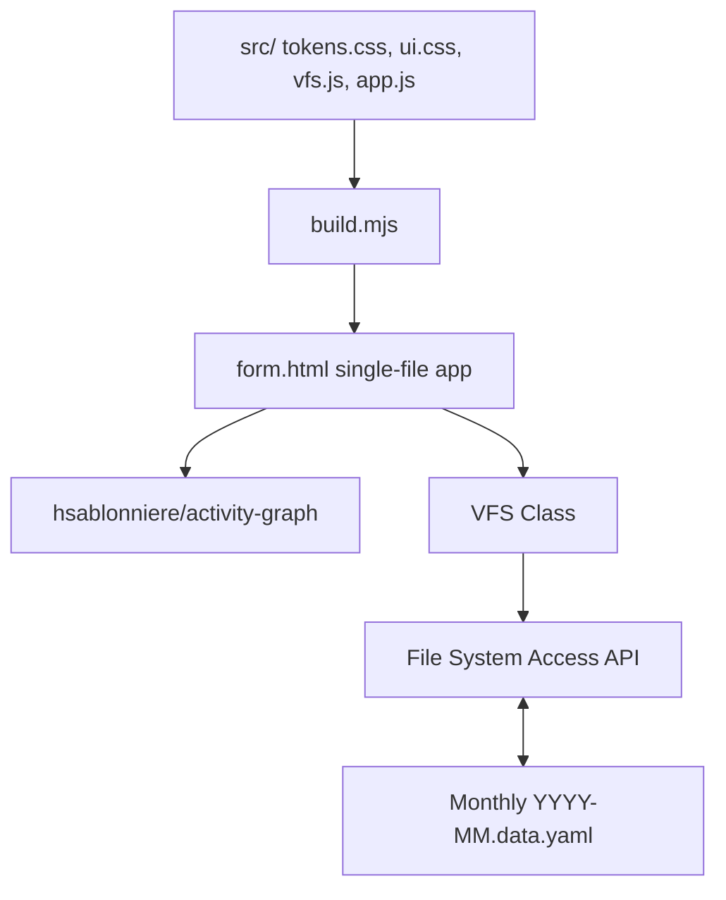

# AGENTS.md

Guidance for AI coding agents working in this repository.

## Project Overview

Client-side web app for logging daily activities and visualizing them as a year-long GitHub-style contribution graph. Authored in separated `src/` files and built into a single self-contained `form.html` via `build.mjs`. Data stays in the browser via the File System Access API.



## Architecture

### Source → build → ship

- `src/tokens.css` — design tokens (light + dark, per-board color ramps, spacing, radius, shadow, motion).
- `src/ui.css` — components and the Layout A shell (sidebar + main).
- `src/vfs.js` — `window.VFS`: File System Access API wrapper (monthly YAML files under an OPFS `data/` directory).
- `src/app.js` — app logic: boards, graph render + per-board retint, day select, add/delete entries, stats, export, year jumper, theme toggle.
- `build.mjs` inlines the four source files into `form.html`. Run `node build.mjs` (or `--watch`).

**Edit `src/`, not `form.html`** — `form.html` is a generated artifact.

### Storage

File System Access API (`navigator.storage.getDirectory()` → OPFS). Monthly files `YYYY-MM.data.yaml` under a `data/` directory, serialized with `js-yaml`. Structure: `{ boardName: { "YYYY-MM-DD": [ { description: "..." } ] } }`. Requires a Chromium-based browser.

### Layout A

256px sidebar (brand, board list with colored dots + active state, new/rename board, year jumper, theme toggle, storage status) + main area (topbar, page head with live stats, year graph card with legend, day-entry panel). Collapses to a single column < 860px.

### Per-board colors

Each known board (default/coding/reading/fitness) owns a 6-level intensity ramp (`--<board>-0..6`) in both themes. The active board's ramp is mapped onto `--lvl0..--lvl6` at runtime. Unknown boards fall back to the `default` (green) ramp.

## Development

```bash
node build.mjs --watch          # rebuild on src/ change
python3 -m http.server 8000     # serve
# open http://localhost:8000/form.html
```

External deps load from CDN: `@hsablonniere/activity-graph` (ESM), `js-yaml` (UMD). No npm install, no runtime build.

## File Structure

```
├── src/                # source (tokens.css, ui.css, vfs.js, app.js)
├── build.mjs           # inlines src/ → form.html
├── form.html           # built app (generated — do not hand-edit)
├── index.html          # read-only preview of the current month
├── AGENTS.md           # agent guidance (this file)
├── README.md           # project overview
├── PRODUCT.md          # product context + design principles
├── DESIGN.md           # design system (tokens, components, states)
└── docs/               # requirements, ADR, UI backlog
```

## Conventions

- No optional chaining (`?.`) in JS — the pi-lens tree-sitter grammar doesn't parse it; use explicit null checks.
- Build DOM with `createElement`/`textContent`, not `innerHTML` (XSS rule).
- `fmt()` must use local date components, not `toISOString()` (UTC drift across year jumps).
- Tokens are OKLCH-minded; keep the light/dark pair in sync when adding colors.

## Browser Testing

Use the Chrome DevTools MCP tools (navigate, snapshot, evaluate) or Playwright MCP. The app needs the File System Access API, so test in Chromium.
