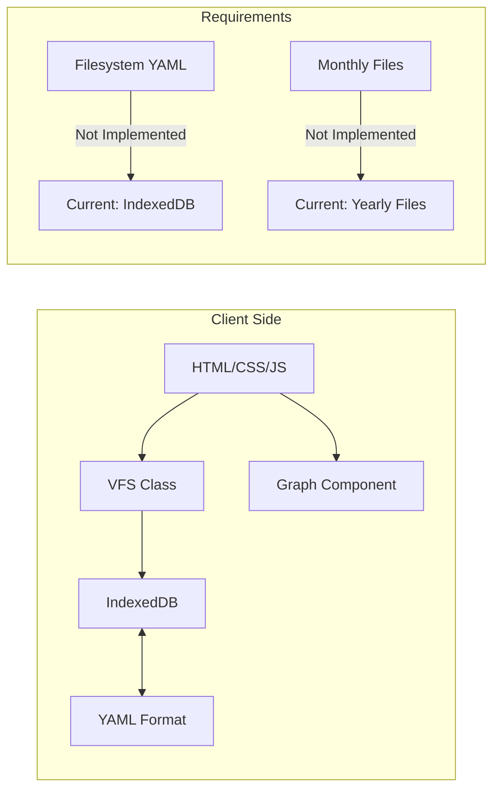
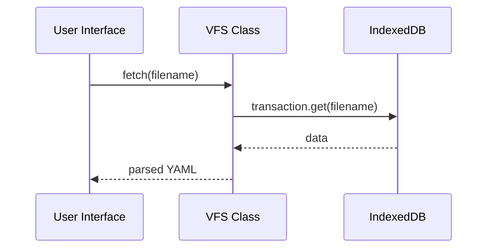
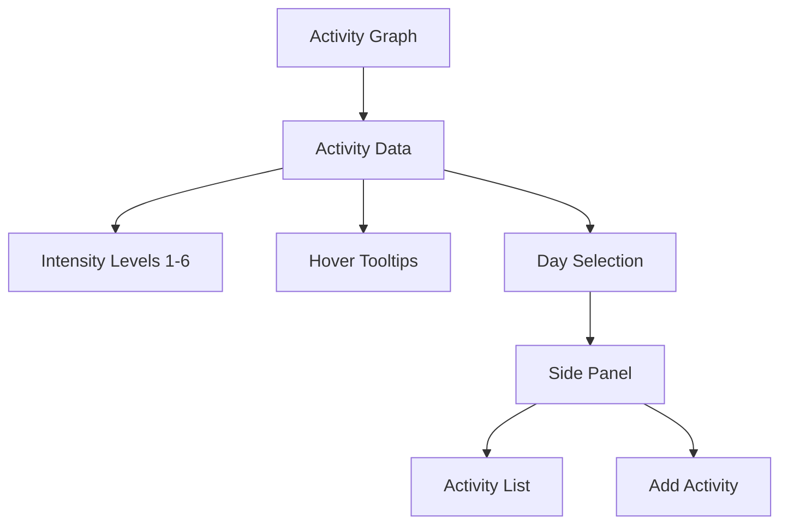
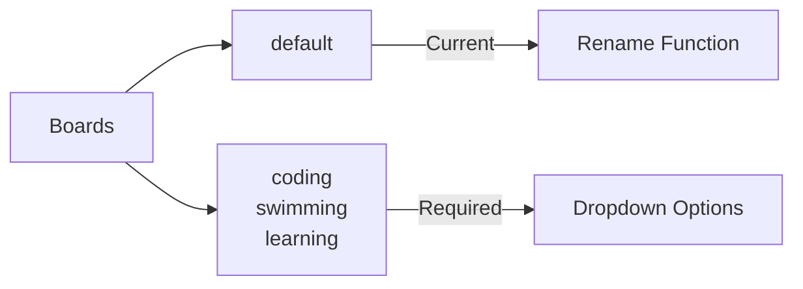
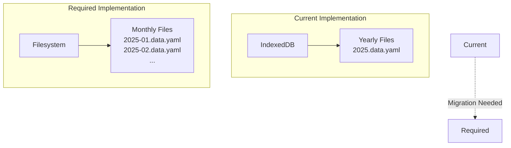
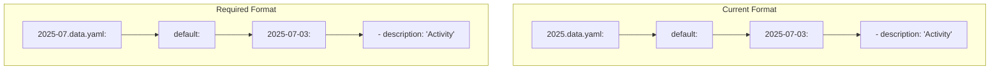
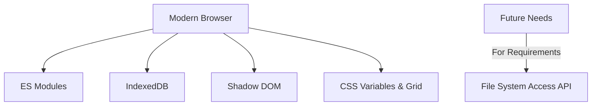
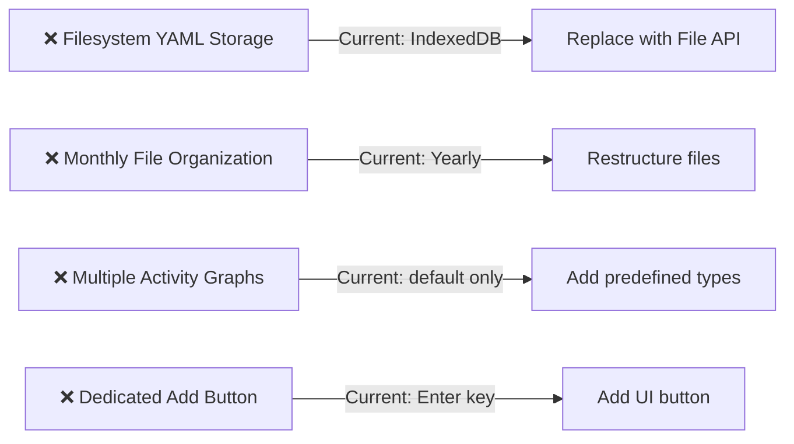

# CLAUDE.md

This file provides guidance to Claude Code (claude.ai/code) when working with code in this repository.

## Project Overview

Client-side web application for tracking and visualizing daily activities using GitHub-style contribution graphs. Built as a single HTML file with embedded CSS/JS.

```mermaid
graph TD
    A[form.html] --> B[Activity Graph Component]
    A --> C[VFS Class<br>IndexedDB Storage]
    A --> D[UI/Logic]
    B --> E[@hsablonniere/activity-graph]
    C --> F[IndexedDB]
    C --> G[YAML Serialization]
    D --> H[Day Selection]
    D --> I[Activity Entry]
    D --> J[Board Management]
```

## Architecture Overview



### Key Components

#### Virtual File System (VFS)
- **Current**: IndexedDB interface with YAML serialization
- **Required**: Filesystem access via File System Access API
- **Status**: Temporary implementation (⚠️ needs replacement)



#### Activity Graph System


#### Board Management


## Current vs Required Implementation

### Storage Strategy


### Data Structure


## Development Commands

No build system required. Serve locally:
```bash
live-server --port=8000 --open=form.html --host=localhost
```
Open: http://localhost:8000/form.html

## Browser Requirements



## File Structure
```
├── form.html               # Main interactive app
├── index.html             # Read-only preview  
├── settings.yaml          # Field configuration
├── 2025-07.data.yaml      # Sample data (IndexedDB only)
├── archive/               # Legacy code
└── docs/
    └── requirements-status.md  # Implementation tracking
```

## Known Implementation Gaps



## Quick Reference

| Component | Status | Action Required |
|-----------|--------|-----------------|
| Base UI | ✅ Complete | None |
| Activity Entry | ✅ Complete | None |
| Graph Rendering | ✅ Complete | None |
| Storage System | ⚠️ Temporary | Replace with filesystem |
| File Organization | ⚠️ Yearly | Convert to monthly |
| Board System | ⚠️ Basic only | Add predefined types |

## Browser Testing with Playwright MCP

For web testing and browser automation, use Playwright MCP tools:
- Navigate: `mcp__playwright__browser_navigate(url)`
- Interact: `mcp__playwright__browser_click(element, ref)`
- Wait: `mcp__playwright__browser_wait_for(time)`