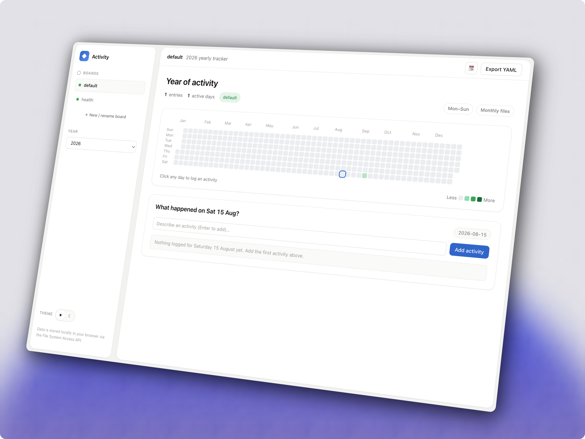

# Activity Grapher


Log daily activities and visualize them as a year-long GitHub-style contribution graph. Client-side only, single self-contained HTML file. Data lives on disk.

## Run

```bash
node build.mjs          # build src/ → form.html
python3 -m http.server 8000   # serve
# open http://localhost:8000/form.html
```

A Chromium-based browser is required (File System Access API).

## How it works

- **Graph**: [`@hsablonniere/activity-graph`](https://github.com/hsablonniere/activity-graph) web component.
- **Storage**: Dual storage via File System Access API. Primary: real `YYYY-MM.data.yaml` files on disk (`showDirectoryPicker()` — user-owned, survives browser data clearing). Backup: OPFS copy on every write. Directory handle persisted in IndexedDB across sessions. Serialized with `js-yaml`.
- **Boards**: parallel activity streams (default, coding, reading, fitness, or your own). Each board owns a color; the graph ramp retints to the active board. Separate **New board** and **Rename** actions.
- **Themes**: light + dark, toggle persisted, respects `prefers-color-scheme`.

## Project layout

```
src/            # source: tokens.css, ui.css, vfs.js, app.js
build.mjs       # inlines src/ into a single form.html
form.html       # built app (the artifact you open)
index.html      # read-only preview of the current month
test/           # bun tests (boards.test.mjs)
PRODUCT.md      # product context (register, purpose, principles)
DESIGN.md       # design system (tokens, components, states)
docs/           # requirements, ADR, UI backlog
```

## Develop

Edit files in `src/`, then `node build.mjs --watch` to rebuild on change. `form.html` is generated — edit source, not the build output. Tokens and components are documented in `DESIGN.md`.

## Test

```bash
bun test
```

## Features

Year graph with day-click logging, todo mode (items start incomplete, check to complete, only done reflected on graph), board sidebar with live counts, separate new/rename board actions, add/delete entries, live stats (entries / active days), Export YAML, year jumper, intensity legend, teaching empty states, full keyboard focus, and reduced-motion support. Responsive from 360px to 1920px.
