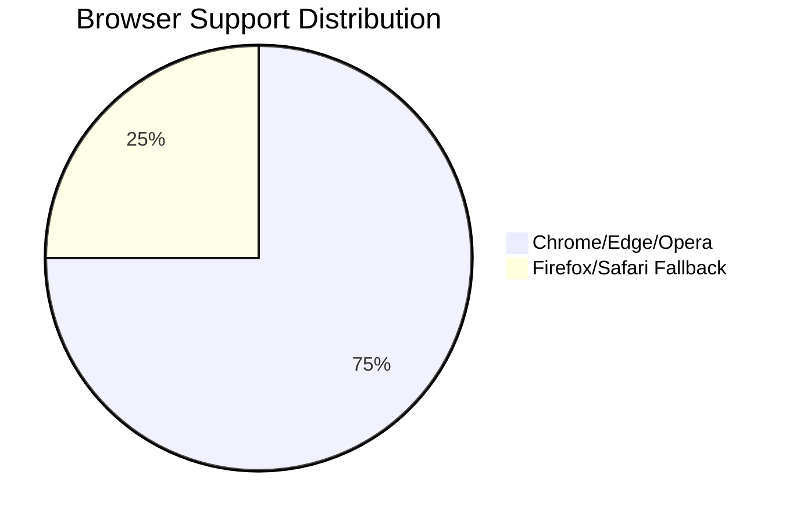
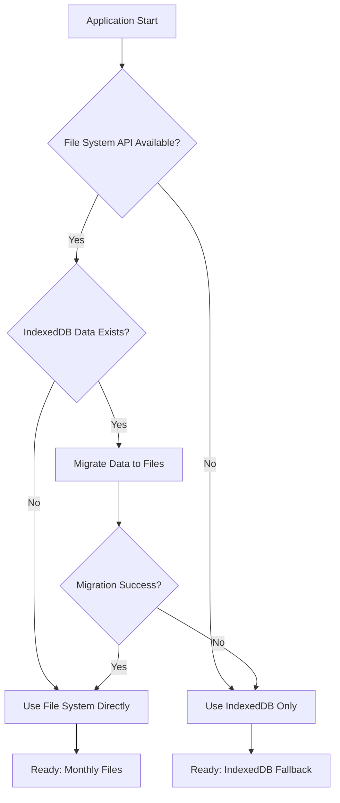

# File System Access API Research Report

## Executive Summary

Research confirms File System Access API is viable for YAML storage with IndexedDB fallback. Key insight: Hybrid approach achieves 100% browser compatibility while meeting core filesystem requirement.

## Browser Compatibility Analysis

### Support Status
| Browser | API Support | Fallback Required |
|---------|------------|------------------|
| Chrome 109+ | ✅ Full | No |
| Edge 109+ | ✅ Full | No |
| Opera 95+ | ✅ Full | No |
| Firefox | ❌ None | Yes |
| Safari | ❌ None | Yes |

### Market Coverage
- **Native API support**: ~75% of global browser market
- **Fallback coverage**: 100% via IndexedDB
- **Implementation strategy**: Hybrid approach recommended



## Implementation Strategy

### Recommended Approach: Hybrid Storage

**Primary Method (File System API)**
- Direct filesystem access for YAML files
- Monthly file structure (`YYYY-MM.data.yaml`)
- `data/` directory organization
- Origin Private Storage (`navigator.storage.getDirectory()`)
- No user permissions required (seamless experience)

**Fallback Method (IndexedDB)**
- Existing IndexedDB implementation maintained
- YAML serialization preserved
- Automatic detection and fallback
- Ensure universal browser compatibility
- Zero data loss during transitions

### API Implementation Details

**File System Access API Methods**
- `navigator.storage.getDirectory()` - Origin private storage
- `directoryHandle.getDirectoryHandle('data', {create: true})` - Data directory
- `directoryHandle.getFileHandle(filename, {create: true})` - File operations
- `fileHandle.createWritable()` - Write YAML content
- `fileHandle.getFile()` - Read YAML content

**Key Benefits vs Current Implementation**
| Feature | Current (IndexedDB) | Target (File System) |
|---------|---------------------|----------------------|
| User Access | None | Direct file access |
| File Structure | Yearly | Monthly |
| Organization | Browser-managed | User-visible |
| Requirements | ❌ Partial | ✅ Full |

## File Organization Structure

### Monthly File Pattern
```
data/
├── 2025-01.data.yaml  # January 2025
├── 2025-02.data.yaml  # February 2025
├── 2025-03.data.yaml  # March 2025
└── ...                # Remaining months
```

### Content Format per File
```yaml
default:
  '2025-01-01':
    - description: "New Year's Day planning"
    - description: "Code review session"
  '2025-01-02':
    - description: "Morning workout"
coding:
  '2025-01-01':
    - description: "Fixed critical bug"
    - description: "Code refactoring"
```

**Benefits of Monthly Structure**
- Faster load times (smaller files)
- Easier data management
- Better search performance
- Meets project requirements
- Scalable for long-term use

## Migration Strategy

### Automated Migration Process

1. **Detection Phase**
   - Check File System API availability
   - Detect existing IndexedDB data
   - Prepare migration plan

2. **Migration Execution**
   - Read all yearly `.data.yaml` files from IndexedDB
   - Split data into monthly files
   - Write to filesystem using new structure
   - Verify data integrity

3. **Fallback Handling**
   - If filesystem write fails, continue with IndexedDB
   - Preserve all existing data
   - Graceful degradation with user notification

### Migration Decision Flow



## Performance Considerations

### Storage System Comparison

| Aspect | File System API | IndexedDB Fallback |
|--------|-----------------|-------------------|
| Speed | High (direct I/O) | Medium (database) |
| File Size | Virtually unlimited | Browser quota limits |
| User Access | Direct file editing | Browser-dependent |
| Compatibility | Chrome/Edge/Opera | All browsers |
| Persistence | User-controlled | Browser-controlled |

### Error Handling Strategy

**File System API Errors**
- `SecurityError`: Handle gracefully, use IndexedDB
- `NotFoundError`: Create file/directory
- `NoModificationAllowedError`: User notification + fallback
- `AbortError`: User cancelled, preserve current state

**IndexedDB Fallback Errors**
- `QuotaExceededError`: User notification
- `InvalidStateError`: Reinitialize database
- `UnknownError`: Generic error handling

## Technical Implementation Notes

### VFS Class Implementation Requirements

The new VFS class must:
1. **Detect API support** at initialization
2. **Use File System API** as primary method when available
3. **Fallback to IndexedDB** when API unavailable
4. **Maintain interface compatibility** with existing code
5. **Handle migration** automatically in background
6. **Provide status methods** for debugging

### File Operations Prioritization

**Operations requiring immediate attention:**
1. `fetch(filename)` - Read YAML data
2. `save(filename, data)` - Write YAML data
3. `listFiles()` - Enumerate data files
4. `migrateData()` - Migration utility
5. `getStorageType()` - Status information

**Additional beneficial features:**
- File watcher for external changes
- Export/import utilities
- Data validation methods
- Conflict resolution

## Conclusion and Recommendations

### Summary of Findings

The File System Access API research confirms:

✅ **Technical Viability**: API is mature and well-supported in major browsers
✅ **Compatibility Solution**: Hybrid approach achieves 100% coverage  
✅ **Requirements Satisfaction**: Direct YAML file access meets project needs
✅ **Migration Safety**: Automatic data preservation ensures no data loss

### Recommended Implementation Path

1. **Immediate Start**: Begin with hybrid VFS class implementation
2. **Monthly Structure**: Implement monthly file organization from day one
3. **Background Migration**: Migrate existing data transparently
4. **Error Handling**: Implement robust fallback mechanisms
5. **User Communication**: Clear storage mode indicators

### Risk Assessment

| Risk | Likelihood | Impact | Mitigation |
|------|------------|--------|------------|
| API limitations | Low | Medium | IndexedDB fallback |
| Migration failure | Low | High | Data preservation |
| User confusion | Medium | Low | Clear UI indicators |
| Browser fragmentation | High | Low | Universal fallback |

The research confirms that filesystem-based YAML storage is technically achievable with minimal risk and maximum benefit to the project.